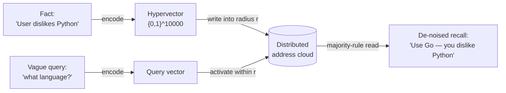
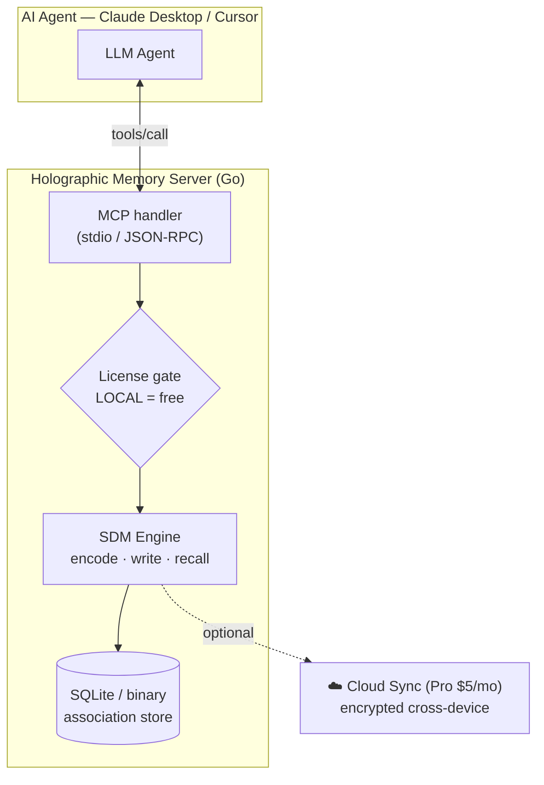
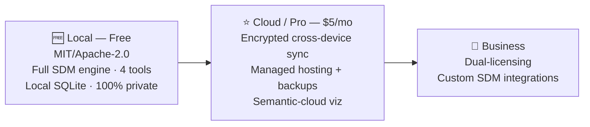

# 🧠 Holographic Memory — MCP Server (Go)

**🌐 Website:** [holo.ai3d.art](https://holo.ai3d.art) &nbsp;·&nbsp; **Live (GitHub Pages):** [neo37.github.io/holographic-memory](https://neo37.github.io/holographic-memory/)
&nbsp;·&nbsp; Open-source · Privacy-first · $5/mo cloud

> The first **fully open-source, privacy-first holographic long-term memory** for AI agents.
> Built on Kanerva's **Sparse Distributed Memory (SDM)** — the associative memory that recent
> research (2021–2026) proved to be mathematically equivalent to the **Attention** mechanism
> inside Transformers (GPT-4, Claude).

Give Claude Desktop, Cursor and any MCP-compatible agent a memory that **thinks by
association**, not by keyword match. Say *"I don't like Python"* today, ask *"what should I
write this script in?"* next month — and the agent recalls *"Go, because you don't like
Python."* Plain vector RAG can't do that. Interference-based recall can.

---

## Table of Contents / Оглавление

| # | English | Русский |
|---|---------|---------|
| 1 | [Why Holographic Memory](#1-why-holographic-memory) | Зачем голографическая память |
| 2 | [How It Works](#2-how-it-works) | Как это работает |
| 3 | [The Math](#3-the-math) | Математическая модель |
| 4 | [MCP Tools](#4-mcp-tools) | Инструменты MCP |
| 5 | [Architecture](#5-architecture) | Архитектура |
| 6 | [Editions & Pricing](#6-editions--pricing) | Редакции и цены |
| 7 | [Install](#7-install) | Установка |
| 8 | [Tech Stack](#8-tech-stack) | Технологический стек |
| 9 | [Roadmap](#9-roadmap) | Дорожная карта |
| 10 | [Documentation](#10-documentation) | Документация |
| 11 | [License](#11-license) | Лицензия |

---

## 1. Why Holographic Memory

Classic RAG is literal: no keyword overlap → no hit. SDM stores every fact as a
high-dimensional binary vector (`{0,1}ⁿ`, n ≈ 10 000) **smeared across many addresses**.
Recall reconstructs the signal by majority vote over everything inside the activation radius,
so it survives noise, partial cues and vague prompts — and it surfaces *connections* the user
only hinted at.

| | Vector RAG | Holographic Memory (SDM) |
|---|---|---|
| Match model | keyword / cosine similarity | associative interference |
| Vague query | misses | reconstructs from noise |
| Conflicting facts | silently coexist | flagged as interference |
| Foundation | ad-hoc embeddings | Kanerva SDM ≈ Transformer Attention |

## 2. How It Works



A fact is not stored in one row — it is superposed across every hard location within a
Hamming radius. Reading a noisy or vague cue re-collects those overlapping traces and votes
them back into a clean answer.

## 3. The Math

Implemented in Go, straight from Kanerva's SDM:

- **Distance — Hamming:** &nbsp; `d(A, B) = Σᵢ (Aᵢ ⊕ Bᵢ)`
- **Write — interference:** activate every hard location within radius `r` of address `X`,
  then increment/decrement their counters (wave superposition):
  `Activate(X) = { Y ∈ HardLocations | d(X, Y) ≤ r }`
- **Read — associative recall:** sum activated cells around query `Q`, apply the majority rule:
  `Outputᵢ = sign( Σ_{Y ∈ Activate(Q)} CellContents(Y)ᵢ )`

This reconstructs a 100%-clean context even from a noisy or partially forgotten query.

## 4. MCP Tools

| Tool | What it does |
|---|---|
| `store_holographic_snapshot` | Store a structured memory (fact + context + emotional valence + importance + tags) as a superposed hypervector. |
| `recall_by_association` | Retrieve a de-noised "meaning cloud" from a vague or emotional cue. |
| `interference_analysis` | Detect when a new fact collides with an existing belief; return the conflict + confidence. |
| `consolidate_and_prune` | "Sleep": drop weak associations, reinforce frequently used ones, keep the store fast. |

<details>
<summary><b>Example — associative recall</b></summary>

```json
{
  "name": "recall_by_association",
  "arguments": { "query": "the project I worked on when I felt down", "association_depth": 3 }
}
```
</details>

<details>
<summary><b>Example — interference detection</b></summary>

```json
{ "name": "interference_analysis", "arguments": { "new_fact": "I moved to Berlin" } }
// → { "conflict_detected": true, "previous_memory": "User lives in London", "confidence": 0.85 }
```
</details>

## 5. Architecture



## 6. Editions & Pricing

This project ships **Open-Core**: the engine is free and open, convenience is paid.



- **Local (Free)** — runs 100% on your machine; your memories never leave your computer.
- **Cloud / Pro ($5/mo)** — same memory in Claude at work and Cursor at home; managed,
  backed up, and visualized.
- **Business** — closed-source embedding rights + bespoke integrations.

## 7. Install

```bash
# One command via Smithery
npx -y @smithery/cli install holographic-memory
```

Or add it manually to `claude_desktop_config.json`:

```json
{
  "mcpServers": {
    "holographic-memory": {
      "command": "uvx",
      "args": ["holographic-memory-server"],
      "env": {
        "MEMORY_MODE": "LOCAL",
        "MEMORY_LICENSE_KEY": "optional — only for Cloud/Pro sync"
      }
    }
  }
}
```

`MEMORY_MODE=LOCAL` needs no key and is free forever. Set a `MEMORY_LICENSE_KEY` (get one at
**[holo.ai3d.art](https://holo.ai3d.art)**) only to unlock encrypted cross-device sync.

## 8. Tech Stack

- **Go 1.24+** — fast, low RAM, single static binary
- **MCP over stdio** (JSON-RPC)
- **Local storage** — SQLite / binary association file implementing Kanerva SDM
- **Docker** — multi-stage Alpine build
- **Payments** — Lemon Squeezy (license keys + subscriptions)

## 9. Roadmap

| Tier | Focus | Status |
|---|---|---|
| **1** | Long-term memory for Claude Desktop / Cursor | 🚧 In progress |
| **2** | Game engines (Unity / Unreal) — NPC skeletal "muscle memory" | 🔭 Planned |
| **B2B** | Logs / SIEM anomaly detection (patterns smeared across time) | 🔭 Planned |

Full timeline & Gantt: see **[docs/GTM_PLAN.md](docs/GTM_PLAN.md)**.

## 10. Documentation

- 🌐 **[Live site (GitHub Pages) — holo.ai3d.art](https://holo.ai3d.art)** · fallback URL: [neo37.github.io/holographic-memory](https://neo37.github.io/holographic-memory/) — landing page source is [`index.html`](index.html)
- 📋 **[Technical Specification (SRS) / Техническое задание](docs/TECHNICAL_SPEC.md)**
- 🚀 **[Go-to-Market Plan & Gantt / План выхода на рынок](docs/GTM_PLAN.md)**
- 🧩 **[MVP Status / Статус MVP](docs/MVP_STATUS.md)**
- 📖 **[Project Story / История проекта](docs/story-holographic-memory.md)**

## 11. License

**Dual-licensed:**

- **AGPL-3.0** (free) — personal, self-hosted, and open-source use. If you run a modified
  version as a network service, AGPL requires you to publish your corresponding source. See
  [`LICENSE`](LICENSE).
- **Commercial License** (paid) — **required** to embed this software in a closed-source or
  commercial product, or to run it inside a proprietary service without publishing your source.
  Get it at **[holo.ai3d.art](https://holo.ai3d.art)**. See
  [`COMMERCIAL-LICENSE.md`](COMMERCIAL-LICENSE.md).

---

*"Smart long-term memory for Claude that doesn't forget the context of a chat from a week ago."*
