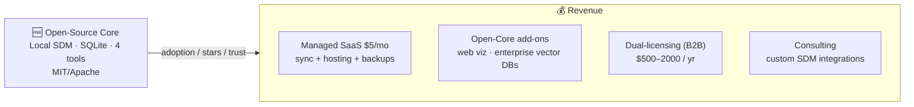
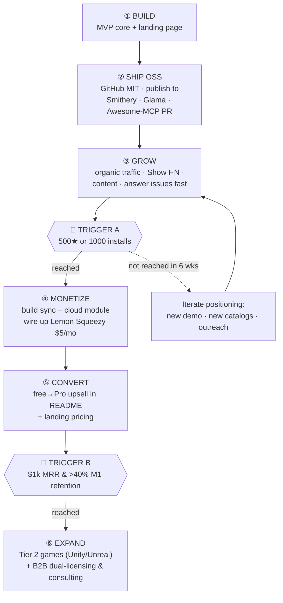
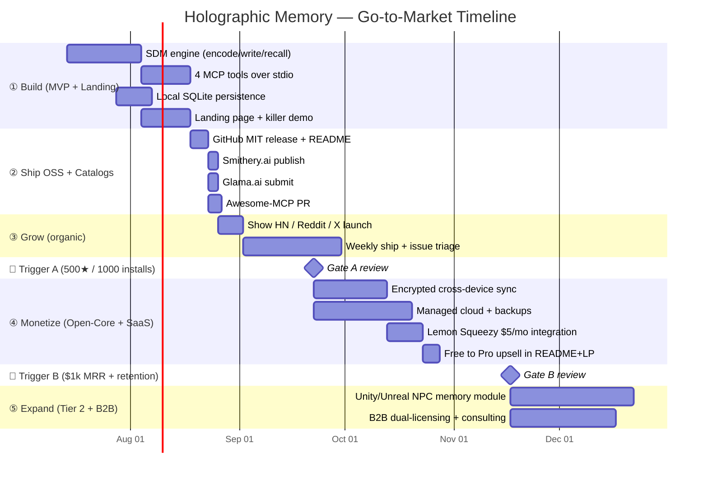

# 🚀 Go-to-Market Plan
### Holographic Memory MCP Server

> Primary language: **English**. Оглавление продублировано на русский язык.
> Strategy: **Open-Core + Managed SaaS** — free open engine drives adoption; convenience is paid.

---

## Table of Contents / Оглавление

| # | English | Русский |
|---|---------|---------|
| 1 | [Strategy in One Line](#1-strategy-in-one-line) | Стратегия одной строкой |
| 2 | [Target Market](#2-target-market) | Целевой рынок |
| 3 | [Monetization Model](#3-monetization-model) | Модель монетизации |
| 4 | [The Action Scenario](#4-the-action-scenario) | Сценарий действий |
| 5 | [Landing Page — What to Show](#5-landing-page--what-to-show) | Лендинг — что показывать |
| 6 | [Gantt Chart](#6-gantt-chart) | Диаграмма Ганта |
| 7 | [Triggers & Decision Gates](#7-triggers--decision-gates) | Триггеры и точки решений |
| 8 | [Distribution Channels](#8-distribution-channels) | Каналы дистрибуции |
| 9 | [KPIs](#9-kpis) | Ключевые метрики |

---

## 1. Strategy in One Line

Ship the SDM engine **free and open-source** (MIT) to win GitHub stars and top the MCP
catalogs → then charge **$5/mo** for the things open code can't copy: **cross-device sync +
managed cloud**. Later expand into high-value niches (games, B2B SIEM).

## 2. Target Market

| Tier | Segment | Why they pay | Timing |
|---|---|---|---|
| **1** | Claude Desktop / Cursor power users | Long-term memory that beats RAG | Launch — fastest money |
| **2** | Game devs (Unity / Unreal) | NPC "muscle memory" via SDM (cerebellum roots) | Scale — bigger checks |
| **B2B** | SIEM / log-analytics teams | Anomalies smeared across time | Scale — enterprise |

Start with Tier 1: the MCP audience is already warmed up by the protocol.

## 3. Monetization Model

**Payments:** Lemon Squeezy handles cards worldwide, subscriptions, and license-key
generation. The Go server validates keys via `/v1/licenses/validate` (only in paid mode).

## 4. The Action Scenario

The concrete "do X → then Y → after trigger Z → do A" playbook:

**Narrated flow:**

1. **Build the MVP + landing first.** MVP = Go SDM engine + 4 tools + local SQLite, running in
   Claude Desktop end-to-end. In parallel, a one-page landing that *demonstrates* the killer
   feature (see §5).
2. **Ship open-source, then publish everywhere.** Push to GitHub under MIT. Submit to
   Smithery.ai, add to Glama.ai, open a PR to Awesome-MCP. Positioning: *"the first fully open,
   privacy-first holographic memory for AI."*
3. **Grow organically.** Show HN / Reddit / X, reply to every issue, ship weekly. Goal: stars,
   installs, trust.
4. **Trigger A fires (500★ / 1000 installs) → turn on monetization.** Only now build the paid
   surface: encrypted cross-device sync + managed cloud, wired to Lemon Squeezy at $5/mo. (Don't
   build paid infra before demand is proven.)
5. **Convert.** Add the upsell to README and the landing: *"Want the same memory in Claude at
   work and Cursor at home? Enable our encrypted cloud — $5/mo."*
6. **Trigger B fires ($1k MRR + healthy retention) → expand.** Move into Tier 2 (game engines,
   NPC skeletal animation) and B2B (dual-licensing, paid custom integrations).

If Trigger A does **not** fire within ~6 weeks → loop back and iterate positioning/demo/outreach
before spending on paid infrastructure.

## 5. Landing Page — What to Show

Domain: **[holo.ai3d.art](https://holo.ai3d.art)**. The landing has one job: make a developer
*feel* why associative memory beats RAG.

1. **Hero — the killer demo (animated chat):**
   - *Week 1:* "I don't like Python." → stored.
   - *Week 4:* "What should I write this script in?" → **"Go — you told me you dislike Python."**
   - Caption: *"Plain RAG finds nothing here. Holographic memory does."*
2. **Before/After comparison table:** RAG (keyword miss) vs SDM (associative hit).
3. **Privacy pledge:** "100% open-source. Local mode: your memories never leave your machine."
4. **One-command install:** copy-paste `npx -y @smithery/cli install holographic-memory`.
5. **The 4 tools**, each with a one-line "why the agent needs it."
6. **Interference moment:** *"You moved to Berlin? I remembered London — update it?"* — shows
   human-like memory management.
7. **Pricing:** Free (Local) vs Pro $5/mo (Sync + Cloud). CTA → Lemon Squeezy.
8. **Social proof:** GitHub stars badge, Smithery/Glama listings, testimonials.

## 6. Gantt Chart

## 7. Triggers & Decision Gates

| Gate | Condition | If met → | If not met → |
|---|---|---|---|
| **A** | 500 GitHub ★ **or** 1000 installs | Build paid sync + cloud | Iterate demo/positioning, more outreach |
| **B** | $1k MRR **and** >40% month-1 retention | Expand to Tier 2 + B2B | Deepen Tier 1: features, content, SEO |

**Principle:** don't build paid infrastructure before demand is proven. Adoption first, revenue
second, expansion third.

## 8. Distribution Channels

| Channel | Role | Trust |
|---|---|---|
| **Smithery.ai** | Main marketplace, one-command install | High traffic |
| **Glama.ai** | Well-indexed dev catalog | Quality audience |
| **Awesome-MCP (GitHub PR)** | Official Anthropic list | Max credibility |
| **Show HN / Reddit / X** | Launch spikes | Community |
| **Landing page** | Conversion + pricing | Owned |

## 9. KPIs

| Phase | Primary KPI | Target |
|---|---|---|
| Build | MVP works in Claude Desktop E2E | ✅ |
| Grow | GitHub ★ / installs | 500★ / 1000 installs |
| Monetize | MRR / free→Pro conversion | $1k MRR / ≥3% |
| Expand | B2B contracts / Tier-2 pilots | first 3 deals |
