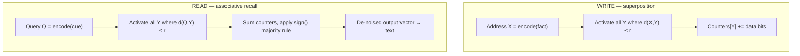
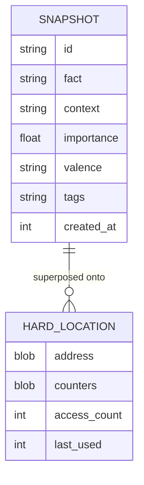
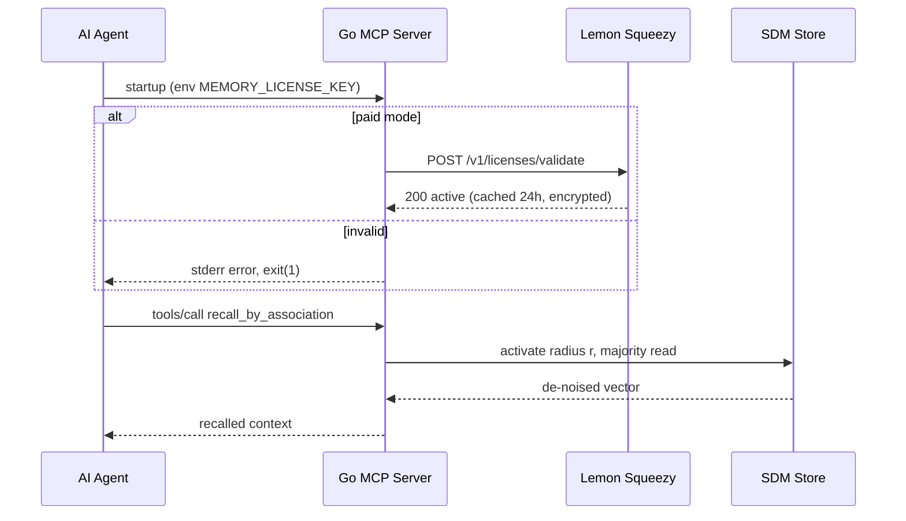

# 📋 Technical Specification (SRS)
### Commercial Holographic Memory MCP Server — Go Edition

> This is the authoritative engineering spec. Primary language: **English**.
> Оглавление продублировано на русский язык ниже.

---

## Table of Contents / Оглавление

| # | English | Русский |
|---|---------|---------|
| 1 | [Purpose & Goal](#1-purpose--goal) | Назначение и цель |
| 2 | [Scope](#2-scope) | Область применения |
| 3 | [Mathematical Model (SDM)](#3-mathematical-model-sdm) | Математическая модель (SDM) |
| 4 | [Technology Stack](#4-technology-stack) | Технологический стек |
| 5 | [Functional Requirements](#5-functional-requirements) | Функциональные требования |
| 6 | [MCP Tool Contracts](#6-mcp-tool-contracts) | Контракты инструментов MCP |
| 7 | [Data Model](#7-data-model) | Модель данных |
| 8 | [Request Sequence](#8-request-sequence) | Последовательность запроса |
| 9 | [Commercial Protection](#9-commercial-protection) | Коммерческая защита |
| 10 | [Non-Functional Requirements](#10-non-functional-requirements) | Нефункциональные требования |
| 11 | [Packaging & Distribution](#11-packaging--distribution) | Упаковка и дистрибуция |
| 12 | [Acceptance Criteria](#12-acceptance-criteria) | Критерии приёмки |

---

## 1. Purpose & Goal

Build a paid, high-performance **Model Context Protocol (MCP)** server in Go that gives AI
agents (Claude, Cursor) access to **long-term associative memory** that is noise-tolerant and
able to link facts by indirect cues. The engine is Kanerva's **Sparse Distributed Memory
(SDM)** — proven equivalent to Transformer Attention (2021–2026 research).

## 2. Scope

| In scope | Out of scope |
|---|---|
| Local SDM engine (encode / write / recall) | Storing raw video / photo pixels |
| 4 MCP tools over stdio | Cloud sync (separate Pro module) |
| Local persistence (SQLite / binary) | Web dashboard (separate Pro module) |
| License validation for paid mode | Training foundation models |

## 3. Mathematical Model (SDM)

Memories are smeared across a high-dimensional binary space `{0,1}ⁿ`, `n = 10 000`.



1. **Distance (Hamming):** `d(A,B) = Σᵢ (Aᵢ ⊕ Bᵢ)`
2. **Activation radius (interference):** `Activate(X) = { Y ∈ HardLocations | d(X,Y) ≤ r }` —
   writes increment/decrement all activated cells (wave superposition).
3. **Read (majority rule):** `Outputᵢ = sign( Σ_{Y ∈ Activate(Q)} CellContents(Y)ᵢ )`.

**Parameters:** `n = 10000` (dimensionality), `r` = critical radius (tunable), hard-location
count sized to expected corpus. All configurable via env / config file.

## 4. Technology Stack

| Layer | Choice | Rationale |
|---|---|---|
| Language | **Go 1.24+** | High throughput, low RAM, single static binary |
| Protocol | **MCP over stdio** (JSON-RPC 2.0) | Native Claude/Cursor integration |
| Storage | **SQLite** or binary association file | Local-first, zero external DB |
| Container | **Docker** multi-stage → Alpine | Tiny image, passes marketplace build tests |
| Payments | **Lemon Squeezy** API | License-key generation + subscriptions |

## 5. Functional Requirements

| ID | Requirement | Priority |
|---|---|---|
| FR-1 | Serve `tools/list` returning the 4 tool schemas | Must |
| FR-2 | `store_holographic_snapshot`: encode text → hypervector → superposed write | Must |
| FR-3 | `recall_by_association`: interference read → de-noised context | Must |
| FR-4 | `interference_analysis`: detect collisions with existing beliefs | Must |
| FR-5 | `consolidate_and_prune`: prune weak links, reinforce strong ones | Should |
| FR-6 | Persist store between restarts | Must |
| FR-7 | Validate `MEMORY_LICENSE_KEY` in paid mode; free `LOCAL` mode | Must |

## 6. MCP Tool Contracts

### `store_holographic_snapshot`
```json
{
  "fact": "User dislikes Python, prefers Go",
  "context": "Refactoring project X",
  "importance": 0.9,
  "valence": "negative",
  "tags": ["preferences", "languages"]
}
```

### `recall_by_association`
```json
{ "query": "the project I worked on when I felt down", "association_depth": 3 }
```

### `interference_analysis`
```json
// in
{ "new_fact": "I moved to Berlin" }
// out
{ "conflict_detected": true, "previous_memory": "User lives in London", "confidence": 0.85 }
```

### `consolidate_and_prune`
```json
{ "max_loss_tolerance": 0.1 }
```

Go schema stub for `tools/list`:

```go
type Tool struct {
    Name        string      `json:"name"`
    Description string      `json:"description"`
    InputSchema InputSchema `json:"inputSchema"`
}
```

## 7. Data Model



`access_count` / `last_used` drive `consolidate_and_prune`.

## 8. Request Sequence



## 9. Commercial Protection

- **Activation:** on start, read `MEMORY_LICENSE_KEY` from env.
- **Validation:** synchronous HTTPS `POST /v1/licenses/validate` to Lemon Squeezy. If inactive
  (subscription cancelled) → write error to `os.Stderr`, exit code `1`.
- **License cache:** status cached locally, **encrypted, 24 h TTL**, to avoid per-request latency.
- **Free tier:** `MEMORY_MODE=LOCAL` bypasses the gate — the open-source engine stays free.
- **Anti-piracy note:** because the code is open, monetization relies on Open-Core value
  (cloud sync, hosting) rather than obfuscation (see GTM plan).

## 10. Non-Functional Requirements

| ID | Requirement |
|---|---|
| NFR-1 | Recall latency < 50 ms for 10k snapshots on a laptop |
| NFR-2 | RAM footprint < 200 MB at n = 10 000 |
| NFR-3 | License check adds ≤ 1 network round-trip per 24 h (cached) |
| NFR-4 | Graceful degradation: store never corrupts on crash mid-write |
| NFR-5 | Cross-platform: Linux, macOS, Windows static binaries |

## 11. Packaging & Distribution

- **Docker:** multi-stage build → Alpine, must pass Smithery.ai automated build tests.
- **Catalogs:** Smithery.ai (auto-index from GitHub), Glama.ai (moderated), Awesome-MCP (PR).
- **Docs:** `README.md` with a direct purchase link and agent-config snippets.

## 12. Acceptance Criteria

- [ ] All 4 tools respond correctly to `tools/list` and `tools/call`.
- [ ] Vague-query recall returns the correct fact from a noisy cue (interference test).
- [ ] `interference_analysis` flags a contradicting fact with confidence.
- [ ] Store survives restart and a simulated mid-write crash.
- [ ] `LOCAL` mode runs with no key; paid mode rejects an invalid/cancelled key.
- [ ] Docker image builds and passes Smithery build check.
